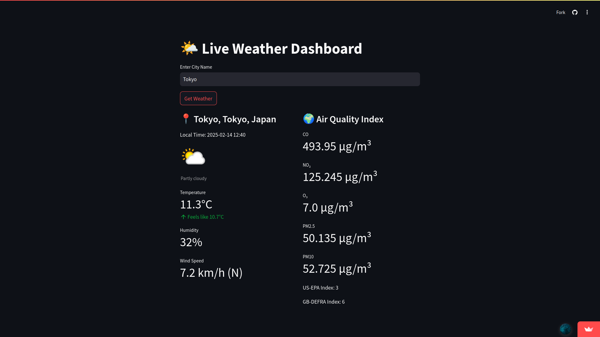

# LiveWeather

A simple live weather dashboard that provides real-time weather details for any city, including air quality information.

## Features
- Get live weather updates for any city.
- View additional details such as temperature, humidity, and wind speed.
- Bonus: Includes air quality index (AQI) data.

## Demo
Try the live demo: [LiveWeather](https://liveweather-ts.streamlit.app/)

## Preview

## Usage
1. Enter the name of the city.
2. View real-time weather data and air quality index.
3. Use the dashboard for quick weather insights.

## License
This project is licensed under the MIT License.
This project is part of a college assignment.

